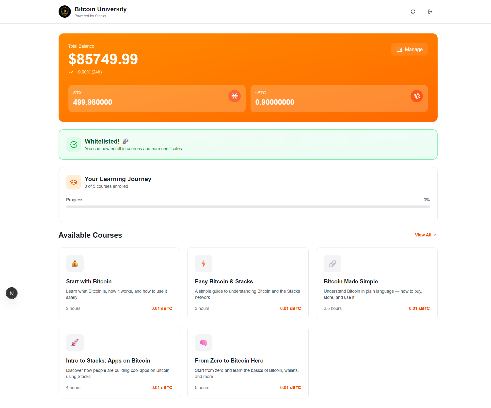

# BTC University

A decentralized learning platform for Bitcoin education built on Stacks (Bitcoin L2) that demonstrates sBTC transactions through an embedded wallet experience. Users create non-custodial wallets via Turnkey's SDK, enroll in Bitcoin courses with sBTC payments, and receive on-chain NFT certificates upon completion.

This project was built for the Stacks Builders Challenge (October 2025) focused on embedded wallets and sBTC integration. The core innovation is seamless transaction signing using Turnkey's API with Stacks blockchain, enabling users to interact with smart contracts without managing keys manually.

## Overview

BTC University integrates Turnkey's embedded wallet SDK to enable frictionless sBTC transactions on Stacks. Users authenticate via passkeys or email, create wallets instantly, and interact with smart contracts to enroll in courses, complete modules, and mint NFT certificates. All credentials are stored on-chain, making them verifiable and portable.

The platform demonstrates three core flows: (1) whitelist enrollment requiring 10 USD in sBTC, (2) course enrollment with on-chain payment, and (3) NFT certificate minting upon course completion. Transaction signing happens server-side via Turnkey's "Sign Raw Payloads" API, with signatures injected into Stacks transactions before broadcast.

## Tech Stack

- **Framework**: Next.js 15 (App Router), React 19, TypeScript
- **Blockchain**: Stacks.js (`@stacks/transactions`, `@stacks/network`), Stacks Testnet
- **Wallet SDK**: Turnkey (`@turnkey/react-wallet-kit`, `@turnkey/sdk-browser`, `@turnkey/sdk-server`)
- **Styling**: Tailwind CSS 4
- **Animation**: Framer Motion
- **Icons**: Lucide React
- **QR Codes**: qrcode.react

## Features

- **Embedded Wallet Creation**: Non-custodial wallets via passkey or email authentication (no seed phrases)
- **sBTC Transactions**: Pay for course enrollment with sBTC on Stacks testnet
- **Smart Contract Integration**: Direct interaction with BTC University contracts for enrollment and verification
- **Whitelist Gating**: Requires sBTC to access platform
- **Course Enrollment**: Five Bitcoin education courses with on-chain enrollment records
- **NFT Certificates**: Mint SIP-009 compliant NFTs as course completion credentials
- **Balance Display**: Real-time STX and sBTC balance tracking
- **Wallet Export**: QR code and key export for wallet portability
- **Transaction Signing**: Server-side signing via Turnkey with ECDSA signature conversion

## Screenshots




## Setup

### Installation

```bash
npm install
```

### Environment Variables

Copy the text from `.env.local.example`

Create `.env.local`:

Get credentials from [Turnkey Dashboard](https://app.turnkey.com).

### Development

```bash
npm run dev
```

App runs at `http://localhost:3000`.

## Clarity Smart Contracts

See other repo. [https://github.com/mohan1233444/btcuniversity-contract](https://github.com/mohan1233444/btcuniversity-contract)

## Transaction Signing Flow

Turnkey integration with Stacks uses raw payload signing:

1. **Build Transaction**: Construct unsigned contract call with `@stacks/transactions`
2. **Extract Hash**: Get `sigHash` from `TransactionSigner`
3. **Sign with Turnkey**: Call Turnkey API with `HASH_FUNCTION_NO_OP`
4. **Convert Signature**: Transform Turnkey's ECDSA signature to RSV format
5. **Inject & Broadcast**: Add signature to transaction and broadcast to Stacks testnet

Implementation in `app/lib/stacks-utils.ts`.

## Project Structure

```
app/
├── api/
│   ├── contract/
│   │   ├── enroll-whitelist/    # Whitelist enrollment endpoint
│   │   ├── enroll-course/       # Course enrollment endpoint
│   │   ├── complete-course/     # Mark course complete
│   │   ├── mint-nft/            # Mint certificate
│   │   ├── check-whitelist/     # Check enrollment status
│   │   └── get-enrolled-ids/    # Get user enrollments
│   └── withdraw/                 # STX transfer endpoint
├── components/
│   ├── createWallet.tsx         # Turnkey wallet creation
│   ├── displayWallet.tsx        # Wallet UI with balance
│   ├── course-enrollment.tsx    # Course interaction
│   ├── nft-certificate.tsx      # Certificate minting
│   └── ...
├── lib/
│   └── stacks-utils.ts          # Stacks/Turnkey integration core
└── dashboard/
    └── page.tsx                  # Main dashboard
```

## API Endpoints

- `POST /api/contract/enroll-whitelist` - Join platform whitelist
- `POST /api/contract/enroll-course` - Enroll in course with sBTC
- `POST /api/contract/complete-course` - Complete course (admin)
- `POST /api/contract/mint-nft` - Mint NFT certificate
- `GET /api/contract/check-whitelist` - Verify whitelist status
- `GET /api/contract/get-enrolled-ids` - Get user's enrollments
- `POST /api/withdraw` - Transfer STX tokens

## Network Configuration

- **Network**: Stacks Testnet
- **API**: Hiro Public API (`https://api.testnet.hiro.so`)
- **Explorer**: https://explorer.hiro.so/?chain=testnet
- **Faucet**: https://explorer.hiro.so/sandbox/faucet?chain=testnet

## Courses Available

1. **Start with Bitcoin** - Bitcoin fundamentals and concepts
2. **Easy Bitcoin & Stacks** - Understanding Stacks as Bitcoin L2
3. **Bitcoin Made Simple** - Practical guide to buying, storing, and using Bitcoin
4. **Intro to Stacks** - Building decentralized applications on Bitcoin
5. **From Zero to Bitcoin Hero** - Complete beginner's journey

## References

- [Turnkey Stacks Documentation](https://docs.turnkey.com/solutions/stacks)
- [Turnkey Stacks Example](https://github.com/tkhq/sdk/tree/main/examples/with-stacks)
- [Stacks.js Documentation](https://stacks.js.org)
- [Hiro Platform Docs](https://docs.hiro.so)
